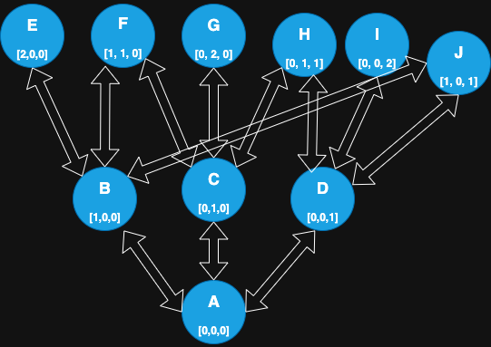
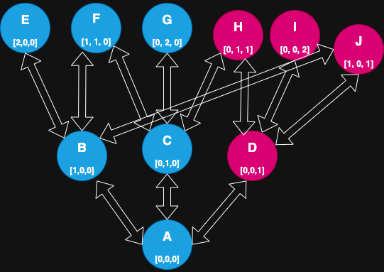
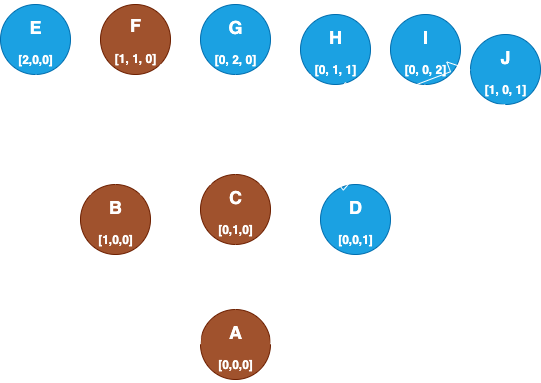
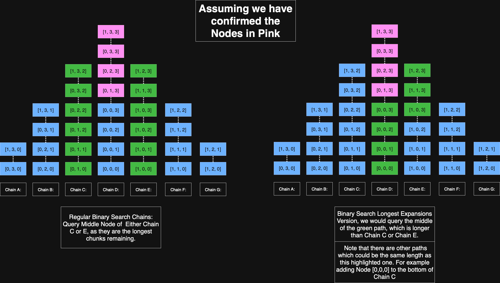
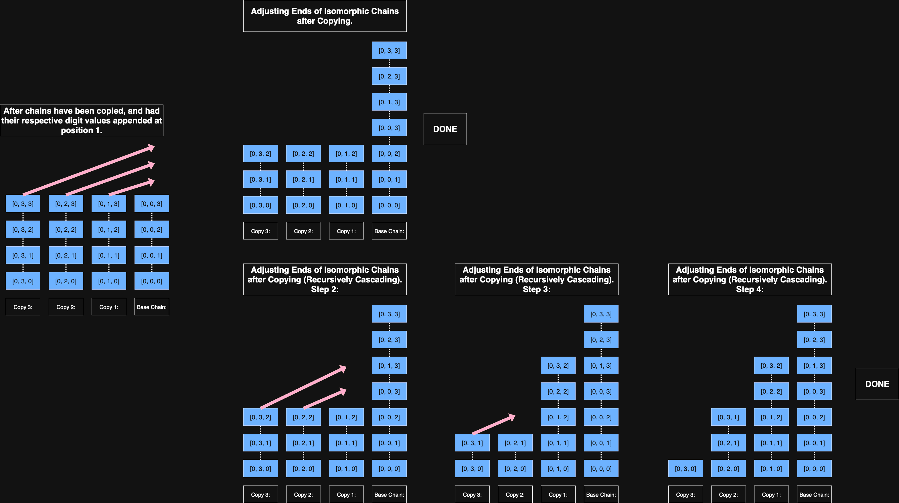

# Concepts and Explanations

## Terminology

### Umbrella cases:
Umbrella cases are a counter of how many **unconfirmed** nodes are above/below a node if you trace it's expansions.
    - Umbrella cases follow the upExpansions (Neighbors, recursively with + 1 in an attribute), and the downExpansions (Same thing but - 1 in an attribute) until we reach dead ends with unconfirmed nodes, or no more nodes.
    - We track this because it gives us a measure of how many nodes each node can update when questioned.
    - We can sort by total size, above size, below size, how balanced a node is, etc.
        - in testing, finding the nodes which are most balanced with largest umbrella is most performant.
    - Umbrella cases are recomputed after each time we ask a question. This is done in the updateNodeRankings function.


Consider this graph for our expansions. The arrows connecting Nodes represent possible expansions between Nodes.
- In this dimension = 3 example, each Node has up to 3 nodes above, and up to three below expansions. 


In this example, we see Node D in pink, showing it has been confirmed as the highest classification for this example. Nodes H, I, J are all above Node D, so they are also confirmed to the pink. 
- For example now, Node A's above umbrella would be made up of nodes B, C, E, F, G. for a total of 5.
- Confirmed nodes don't count towards umbrellas, because we are counting how many nodes would be updated, and those aren't getting updated any more.


- In this example, we have confirmed Node F to be as class 0. We are immediately able to mark B, C, A all as class 0 as well, by the properties of monotonicity.
- This means, Nodes E and G are not confirmed, but have an umbrella size of 0, since they have no other nodes which they can update anymore.
- Node D would have an underneathUmbrella of size 0, and size 3 above.
- Nodes H, I, J, all have an underneath umbrella size of 1, since they still can update Node D.

### Classification Confirmed
- This one is pretty self explanatory, but it is useful to talk about how we get there.
    - **A classification is confirmed for a Node n when n.classification == n.maxPossibleValue**.
    - Every node starts life with classification = 0, and maxPossibleValue = highest possible for the function.
    - we use the classification as the floor, and the maxPossible as a ceiling.

### Possible Confirmations By Class
This is tracked Node by Node. It is an Integer array with one entry per class in our function.
- Recomputed every time we query a Node, in the same updateNodeRankings function as the UmbrellaCases.
- This metric basically does this to compute for each Node:
    - Look at one individual node, say my upstairs neighbor was assigned class 2, does that confirm me as class 2 as well?
        - If so, my upstairs neighbor would count me towards its wouldBeConfirmedForClass[2] entry.
        - If my downstairs neighbor gets classified as whatever my current maxPossibleValue is, that would raise my floor, so we know that I would be confirmed in this case as well.
- Current implementation for bestMinConfirmed is to find the **MINIMUM** value in each Node's possibleConfirmationsByClass, and use whichever Node has the **MAXIMUM** of all our unconfirmed Nodes at a step in the interview.

This helper function is called FROM each node, traversing to other nodes in a BFS while we are updating Node rankings, for each possible class. This way, we are able to count from each node, how many would be confirmed for each class. Using these values, we are able to see how many Nodes we are guaranteed to classify at minimum from each Node.

```
    // determines if a neighbor would get confirmed if it's upstairs or downstairs neighbor were given "hypotheticalClass"
    private boolean wouldBeConfirmedForClass(int hypotheticalClass, boolean countingUpwards) {
        // return false if we're already confirmed.
        if (this.classificationConfirmed){
            return false;
        }

        // if we are counting upwards. this is ABOVE the node which called this on us.
        if (countingUpwards){
            // if the neighbor got confirmed as hypothetical class, we would be confirmed, if that class was already our max possible value.
            return this.maxPossibleValue == hypotheticalClass;
        }
        // if we are counting downwards. this is BELOW the node which we are computing. our classification is already set as the lowerbound. so if our lowerbound is the same as the node's hypothetical class above, then we are confirmed.
        else {
            return this.classification == hypotheticalClass;
        }
    }
```


### Balance Factor
A Node's Balance Factor is the attempt to reconcile two things:
- We want to pick a Node which has a huge umbrella, so that we get to update lots of nodes by questioning it.
- We also want to pick a Node which is balanced in above and below umbrella. 
    - If you just pick one with for example 45 above, 0 below, you basically just use the bottom node every single time and it's worthless.
- We need a way of weighing the size of the umbrella, AND the balancedness. The SMALLEST_DIFFERENCE_UMBRELLA_SORT interview tries to do this. But has a flaw. It sorts Nodes just based on difference between above and below umbrellas, with a tiebreaker of total size.
    - This works well, but could be improved. 
        - Consider the following situation. A Node with aboveUmbrella (count of Nodes we could update which are above this Node) of size 27, and belowUmbrella of size 20. This has a balance factor of 7 obviously.
        - Another Node has aboveUmbrella of size 8, and underneathUmbrella of size 7. It is more balanced, but much smaller. In the current implementation, we would choose this node. We would prefer that larger one.
- Finding a good way to weight the size/balance of a Node could help us find much better Nodes at each step.

### Longest String Of Expansions
We have a method for binary searching a Hansel Chain. A problem with regular binary search can be broken down like this:
- Imagine we take our longest Hansel Chain, and query the middle node. We have now basically cut it in half, the middle node is confirmed, the top and bottom ends may or may not be.
- Say this bottom half of the chain, the top of that portion could also expand to a different node than what it does in the Hansel Chain we arranged it in. A Hansel Chain is just one arrangement of these Nodes' expansions.

The goal of this, is to basically determine what the longest chain of Nodes we have is, which is like a Hansel Chain, where we are moving + 1 in some attribute.
- We find our longest string of such Nodes, and query that middle.

The longest Hansel Chain/Portion of a Hansel Chain, may not actually be the longest chain of expansions remaining at a step in the interview. 
- This version does a DP style approach to compute longest path from a **Leaf Node** (Node with no upExpansions/downExpansions which are unconfirmed. Direction doesn't matter, as long as we are consistent in which we use) to another leaf node. 
    - We then just use that path, and take it's middle.
- This outperforms regular binary search, since we are not limiting ourselves to only using the Nodes as they are arranged in the Hansel Chains.

Consider the following example to see an illustration of why this version outperforms the typical binary search. 
- The highlighted in Green portions show which section would be chosen by each binary search version, respectively.



### Isomorphic Adjustment Step Variations:
When creating Hansel Chains, for each digit, we take all existing chains, copy each one, and append the new digit (with each possible k value). For example, if we have a k value of 4 for a particular digit, we would make 3 new copies, and put 1, 2, 3 onto the front of each Node in the input chain which we copied. 



The cascading version allows us to reduce the amount of chains. In Hansel chains with just boolean values, these would be exactly the same. But with K values for each attribute, it is an important distinction.